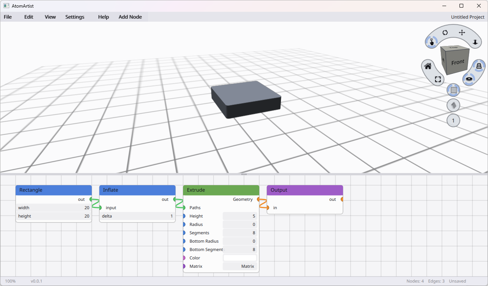

# AtomArtist

[](https://larsbrubaker.github.io/atomartist/)

## Support the Project

<a href="https://buymeacoffee.com/larsbrubaker"></a>

AtomArtist is open-source and free to use, maintained in spare time as a labor of love. Friends James Smith and Dan Ruskin help out from time to time too.

If you find it useful, here are a few ways to help keep development going:

- **Donations:** [Buy Me a Coffee](https://buymeacoffee.com/larsbrubaker) — every coffee helps.
- **Star the repo:** Costs nothing and helps others find the project.
- **Report issues:** [Open an issue](https://github.com/larsbrubaker/atomartist/issues) for bugs or feature ideas.
- **Contribute:** PRs welcome — open an issue first to discuss larger changes.

A visual node-based 3D design tool. Wire together typed nodes — primitives, transforms,
boolean operations, extrusions, imported meshes — and watch the resulting 3D geometry
update live in the viewport.

Targets **Windows**, **macOS**, and the **web** (WASM via WebGPU / WebGL2).

> **Try it in your browser:** [larsbrubaker.github.io/atomartist](https://larsbrubaker.github.io/atomartist/)
> &nbsp;— live build of `demo-wasm` deployed automatically from `main`.

> **Status:** Phase 0 — empty workspace skeleton. Active development.

---

## Architecture

Pure Rust, no JavaScript or TypeScript. Built on:

- **[agg-gui](https://github.com/larsbrubaker/agg-gui)** — immediate-mode GUI framework with wgpu rendering
- **[manifold-rust](https://github.com/larsbrubaker/manifold-rust)** — `MeshGL` and `CrossSection` types, boolean operations
- **[clipper2-rust](https://github.com/larsbrubaker/clipper2-rust)** — 2D path boolean / offset
- **[tess2-rust](https://github.com/larsbrubaker/tess2-rust)** — extrude cap tessellation
- **[wgpu](https://wgpu.rs)** — cross-platform GPU rendering (Vulkan / Metal / DX12 / WebGPU / WebGL2)

### Workspace layout

```
atomartist/
├── atomartist-lib/         # Graph engine, node types, geometry, serialization
├── atomartist-renderer/    # 3D viewport (wgpu) — orbit camera, shaders, gizmos
├── atomartist-ui/          # Shared widget tree — node canvas, property panel, toolbar
├── demo-native/            # winit + wgpu native binary (Windows / macOS / Linux)
└── demo-wasm/              # wasm-bindgen entry for the browser
```

---

## Build

### Native

```bash
cargo run -p demo-native --release
```

### Web (WASM)

The hosted build at <https://larsbrubaker.github.io/atomartist/> is
rebuilt and redeployed by [`.github/workflows/deploy-demo.yml`](./.github/workflows/deploy-demo.yml)
on every push to `main`.

To run the same bundle locally:

```bash
# One-time install:
cargo install wasm-pack basic-http-server

# Build + serve:
wasm-pack build demo-wasm --target web
cd demo-wasm && basic-http-server .
# Open the URL printed (default http://127.0.0.1:4000/) and visit
# /index.html — the page mounts the AtomArtist UI on a full-window
# canvas via wgpu's WebGL2 backend.
```

### Repository layout for sibling crates

atomartist depends on several sibling repositories via path
dependencies (so a local edit in `agg-gui` is picked up immediately).
Clone them next to this repo so the `../../agg-gui/agg-gui` style
paths in our `Cargo.toml` files resolve:

```
parent-dir/
├── atomartist/        (this repo)
├── agg-gui/
├── agg-rust/
├── manifold-rust/
├── clipper2-rust/
└── tess2-rust/
```

CI mirrors this layout on the runner — see the `Checkout …` steps in
`.github/workflows/ci.yml` and `deploy-demo.yml`.

### Tests

```bash
cargo test --workspace
```

---

## License

MIT — see [LICENSE](./LICENSE).

---

Part of the [rust-apps](https://github.com/larsbrubaker/rust-apps) suite — a collection of Rust graphics and geometry libraries by Lars Brubaker.
